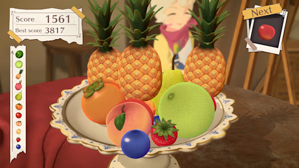

# My first FruitMountain-like in Bevy

## 0. Before the course

[Install Rust](https://www.rust-lang.org/tools/install)

Clone this repo and run this command (the first compile is can take a while)
```
cargo run
```

Optional: Install the rust-analyzer extension for VSCode

You are good to go !

## 1. Basics

I will assume you already know the basics of working with entities, components and systems in Bevy.
If that's not the case, feel free to ask for help.

## 2. Setting up the game

If you don't know what Fruit Mountain is, it's a simple physics game where you throw fruits into a bowl, where similar fruits combine into larger fruit.

The goal is to get the biggest fruit without any fruit falling out of the bowl



We will start by setting up the bowl, the camera and some lighting.

### 2.1 The bowl

## 4 What now ?

Reality can be whatever you want, you can add:

- Add health systems for the player
- Enemy loot
- Upgrades
- New weapons
- Add art to the sprites
- etc...

